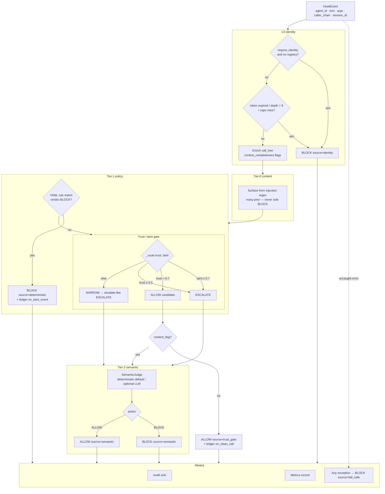
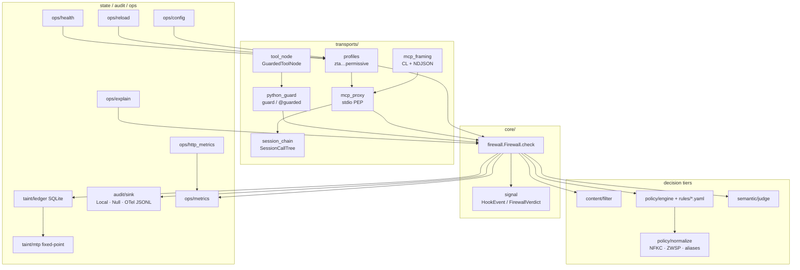
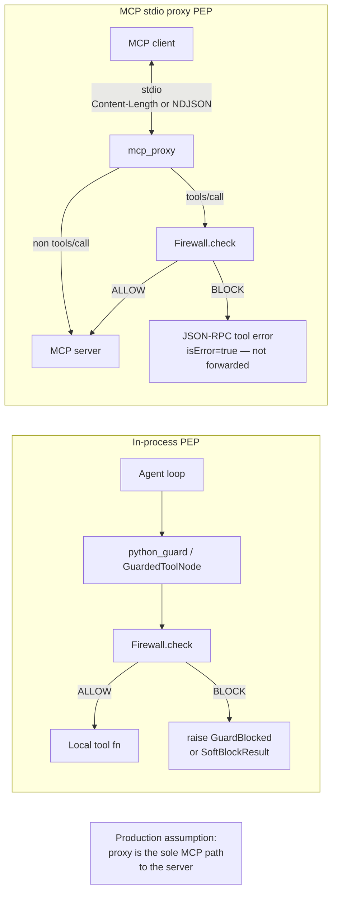

# Tracewall — architecture overview

How Tracewall decides **ALLOW / BLOCK**, where the PEP sits, what is implemented
in code today, what has been tested, and what Senior QA still owes.

Canonical detail: [`FIREWALL.md`](FIREWALL.md). Evidence discipline:
[`../paper/EVIDENCE.md`](../paper/EVIDENCE.md). Operator posture:
[`RUNBOOK.md`](RUNBOOK.md).

**Version snapshot:** 0.2.0 (2026-07-21). No SPIFFE / signed-identity claims.

---

## 1. Enforcement pipeline (ALLOW / BLOCK workflow)

### How `check()` decides

Implementation: `tracewall/core/firewall.py` → `Firewall.check` / `_check`.

1. **L0 identity** — load ledger identity. If `require_identity` and missing → BLOCK.
   If present: expired token, `delegation_depth > 8`, or (when `require_caps` / non-empty
   caps) tool not in capability set → BLOCK. Caps empty + `require_caps` → BLOCK.
2. **Enrich** — copy `caller_chain` into `EnrichedEvent`; set
   `context_completeness` (`identity`, `call_tree`, `ledger`, `session_chain`).
3. **Tier-0 content** — `content.filter.flagged` on args text. High-recall prior;
   **never** the sole BLOCK authority — only forces the semantic path when the
   trust gate would otherwise ALLOW.
4. **Tier-1 policy** — YAML DSL. First BLOCK match → deterministic BLOCK + taint feedback.
5. **Trust/taint gate** — `_route(trust, taint)`:
   - `taint ≥ 0.7` → ESCALATE
   - `trust > 0.7` → ALLOW (unless content_flag)
   - `trust ≥ 0.3` → ESCALATE
   - else → NARROW (currently awaits semantic like ESCALATE)
6. **Tier-2 semantic** — judge returns BLOCK/ALLOW; facade inverts malicious score
   so `FirewallVerdict.score` is always **0.0 bad … 1.0 clean**.
7. **Audit + metrics** — always attempted after the decision; audit failure is logged,
   not re-raised. Internal exceptions in `_check` → **fail-safe BLOCK**
   (`source="fail_safe"`).

### Profiles (`zta` / `paranoid` / `balanced` / `permissive`)

Defined in `tracewall/transports/profiles.py`:

| Profile | fail_closed | require_identity | require_caps | own_call_tree | ZTA pack | Rules |
|---------|-------------|------------------|--------------|---------------|----------|-------|
| **zta** | yes | yes | yes | yes (proxy-owned) | yes | full + `rules/zta/` |
| **paranoid** | yes | yes | no | yes | yes | full + ZTA |
| **balanced** | yes | no | no | no (client `_meta`) | no | full lab pack |
| **permissive** | **no** (fail-open) | no | no | no | no | `destructive_ops` + `minja_memory` only |

**ZTA honesty:** client-asserted `caller_chain` is not authentication. Use `zta` /
`paranoid` so the MCP proxy owns the chain via `SessionCallTree`. Identity is
**ledger-registered**, not SPIFFE-verified.

### Soft-block vs raise

| Path | Behavior |
|------|----------|
| `guard(..., on_block="raise")` (default) | Raises `GuardBlocked` |
| `guard(..., on_block="soft")` | Returns `SoftBlockResult` — tool must **not** execute |
| `GuardedToolNode(..., on_block="soft")` | Soft-block by default; surfaces tool error string |
| MCP proxy | Always returns MCP tool error (`isError: true`); never forwards on BLOCK |
| Fail-closed transport | Missing `agent_id` → synthetic BLOCK (raise or soft per `on_block`) |
| Fail-open transport | Malformed / missing agent may forward (availability over safety) |

---

## 2. System architecture (modules)

| Module | Role |
|--------|------|
| `core/firewall.py` | Single enforcement seam |
| `core/signal.py` | Wire types |
| `policy/engine.py` + `rules/` | Deterministic DSL + ZTA allowlists/rates |
| `policy/normalize.py` | Canonical tool names, NFKC/ZWSP arg scrub |
| `content/filter.py` | Tier-0 injection prior |
| `semantic/judge.py` | Tier-2 (deterministic / optional LLM) |
| `taint/ledger.py` + `mtp.py` | Trust/taint + multi-hop propagation |
| `audit/sink.py` | Append-only verdicts; OTel-**shaped** JSONL |
| `transports/*` | In-process guard, MCP proxy PEP, profiles, tool node |
| `ops/*` | Explain, health, reload, metrics, HTTP scrape, config |

---

## 3. Network / deployment (PEP placement)

**Placement rules**

- **Python guard** — PEP inside the agent process; easy to integrate, easy to
  bypass if another code path calls tools directly.
- **MCP proxy** — out-of-process (or sidecar) PEP between client and server;
  screens **`tools/call` only**. `tools/list` / `initialize` / notifications pass
  through unscanned (documented limit).
- **Reference app** — `examples/reference_mcp_app/` wires a toy MCP server behind
  the proxy for a runnable PEP demo.
- **Not shipped:** HTTP sidecar PEP, cluster rate limits, SPIFFE mTLS identity.

---

## 4. What we implemented (code-grounded)

Evidence from the tree / HANDOFF — **not** aspirational:

- **Enforcement core** — `Firewall.check` L0 → content → policy → gate → semantic → audit/metrics; fail-safe BLOCK.
- **ZTA pack** — `policy/rules/zta/` (email default-deny, HTTP host allowlist, `send_money` rate budget) loaded by `zta`/`paranoid`.
- **Proxy-owned call tree** — `SessionCallTree` + `own_call_tree=True` ignores forged `_meta.caller_chain`.
- **Normalize / bypass closes** — `policy/normalize.py` (NFKC, ZWSP strip, tool-name aliases / case).
- **Profiles** — `paranoid` / `zta` / `balanced` / `permissive` with distinct fail-closed, identity, caps, rule subsets.
- **In-process guard** — `guard` / `@guarded`; soft-block product contract (`SoftBlockResult`).
- **GuardedToolNode** — LangGraph-style node without a `langgraph` dependency (`transports/tool_node.py`).
- **MCP proxy** — stdio PEP; Content-Length + NDJSON auto-detect (`mcp_framing.py`).
- **Reference MCP PEP app** — `examples/reference_mcp_app/` (+ `run_pep_demo.py`).
- **Metrics** — in-process `ops.metrics.Metrics` (block / starve / latency) + HTTP Prometheus text (`ops.http_metrics`).
- **OTel-shaped audit JSONL** — `OTelJsonlAuditSink` (filelog-friendly; **not** OTLP/gRPC).
- **Ops CLIs** — `explain` (dry-run), `health`, `reload` (YAML re-load smoke), `config` (`TRACEWALL_CONFIG`).
- **Policy DSL extras** — org-domain placeholders, secret-reader aliases, `host_in` / `not_in_domain`, `rate_exceeds`, `call_tree_contains(_any)`.
- **Eval lanes** — harness, mcp_brink, adojo_stress (+ live), robustness_stress, latency, AgentDojo adapter.
- **Docs / packaging** — GETTING_STARTED, RUNBOOK, RESULTS, SUPPORT, ENTERPRISE, SECURITY, CHANGELOG.

**Explicitly not claimed:** SPIFFE / IdP-verified identity, full OTLP exporter, SBOM in CI, adaptive paraphrase ASR, travel/workspace live AgentDojo coverage.

---

## 5. Test inventory

### 5.1 Unit / integration (`pytest`)

Collected **2026-07-21**: `pytest --collect-only -q` → **133 tests** from the default tree,
plus **1 collection error** when `agentdojo` is not installed:

| File | Notes / key cases |
|------|-------------------|
| `test_firewall_core.py` | ALLOW high-trust benign; policy BLOCK; semantic escalate; identity caps; call-tree completeness |
| `test_firewall_kb.py` | KB01–KB20 knowledge-base scenarios (injection, exfil, MINJA, MTP hops, fail-safe, trust recovery, PB01 latency) |
| `test_p0_correctness.py` | Org domains, secret-reader aliases, require_identity, ledger feedback polarity, clean score polarity |
| `test_guard.py` | Allow / raise / fail-closed / fail-open / `@guarded` |
| `test_mcp_proxy.py` | Non-tool forward; ALLOW forward; BLOCK tool error; destructive; `_meta` enrich; fail-closed/open malformed; call-tree capability abuse |
| `test_mcp_profiles.py` | Registry for all 4 profiles; rule-count split; identity required vs optional; fail-open vs closed; exfil miss on permissive; context starvation limit |
| `test_mcp_framing.py` | Content-Length roundtrip; NDJSON encode/read |
| `test_zta_practical.py` | Host allowlist; email default-deny; rate_exceeds; require_caps; own call-tree forge ignore; args_hash; RateBudget |
| `test_enterprise_ready.py` | Normalize/aliases; profiles; soft-block; identity/caps; own call-tree; Prometheus HTTP; OTel JSONL; GuardedToolNode; explain/health; reference PEP; starve rate |
| `test_enterprise_ops.py` | Canonical+ZWSP; ZWSP IBAN BLOCK; PascalCase tool; soft-block; metrics.record |
| `test_semantic_tier.py` | Dangerous tool / exfil / call-tree abuse / high taint BLOCK; benign ALLOW |
| `test_taint_mtp.py` | Two-hop, monotonic/bounded, convergence |
| `test_llm_judge.py` | JSON parse; mocked LLM; failure→deterministic; optional live |
| `test_eval_reproducibility.py` | Frozen corpus hash; eval reproducibility; pure-tier pins; gated beats naive OR |
| `test_adojo_stress.py` | Firewall stress matrix all pass; scenarios cover success |
| `test_robustness_stress.py` | Robustness matrix all pass; scenarios include limits |
| `test_trace_replay.py` | Fixture shape + parametrized replay (benign / injection / exfil / destructive) |
| `test_agentdojo_adapter.py` | Import without bench extra; rate math; argparser defaults |
| `test_agentdojo_soft_block.py` | Soft-block rewrites tool name (needs `agentdojo` extra — **collection fails without it**) |

### 5.2 Eval lanes (artifacts + results on disk)

| Lane | Command | Results artifact | Snapshot (repo files) |
|------|---------|------------------|------------------------|
| Held-out harness | `python -m tracewall.eval.harness --split test` | `eval/results/corpus_v0.1_test_*.json` | 27 cases (13 mal / 14 ben). Deterministic **integrated** recall **1.0**, FPR **≈0.071**. Tier-1 recall 1.0 / FPR 0. Regression bar, not adaptive proof. |
| MCP brink | `python -m tracewall.eval.mcp_brink` | `mcp_brink.json` | **18/18** — success 12/12, expected_limit 6/6 |
| AgentDojo stress (firewall-only) | `python -m tracewall.eval.adojo_stress` | `adojo_stress.json` | Firewall matrix **7/7** success |
| AgentDojo live | `adojo_stress --live` / adapter | `adojo_stress_live/**`, `adojo_diag/**` | **Present:** 28 live banking JSONs under `adojo_stress_live/` + 2 diag. Summary rows in `adojo_stress.json` `live[]` (direct base ASR 1.0 → defended ASR 0.0 on sampled tasks; utility can drop under soft-block — see n1×4 rows). **Narrow banking slice** — not travel/workspace suites. |
| Robustness | `python -m tracewall.eval.robustness_stress` | `robustness_stress.json` | **18/18** — success 16, expected_limit 2 (domains: workspace, contagion, host, identity, banking) |
| Latency | `python -m tracewall.eval.latency` | `latency_check.json` | n=400 deterministic; p50≈6.8 ms, p99≈9.8 ms |

**Honesty notes**

- Brink / robustness **expected_limit** rows that still pass are intentional (miss still reproduces).
- Live AgentDojo is **partial** (banking, small n); treat ASR/utility as probes unless EVIDENCE marks VERIFIED.
- `test_agentdojo_soft_block.py` is gated on the optional AgentDojo install.

---

## 6. Senior QA gap matrix

Risk-ordered gaps between **shipped tests** and **production assurance**. Status:
**Covered** (automated evidence), **Partial**, **Missing**.

| Risk | Why it matters | Status | Gap / next evidence |
|------|----------------|--------|---------------------|
| **Identity forgery** | Attacker registers or spoofs `agent_id` / caps | Partial | Ledger register only; no signed / SPIFFE / IdP verifier. Tests cover missing identity + caps gates, not cryptographic bind. |
| **PEP bypass** | Tools called without Tracewall | Missing | Threat model documents it; no runtime integrity / sole-path enforcement tests. |
| **`tools/list` unscanned** | Discovery / schema poisoning without screen | Partial | Brink `expected_limit` proves pass-through; no positive control to screen or redact list. |
| **Unknown tool names** | Pack miss → silent ALLOW on novel tools | Partial | Robustness `expected_limit`; no default-deny-unknown under zta beyond caps. |
| **Multi-session race** | Shared `SessionCallTree` / ledger races | Partial | Lock on chain dict; no chaos/concurrency suite across sessions. |
| **Reload hot-path** | Live proxy keeps stale rules after YAML edit | Partial | `ops.reload` reloads engine in isolation; **no** hot-swap into running proxy process. |
| **Metrics accuracy** | Wrong starve/block rates → bad ops signal | Partial | Unit record + HTTP scrape smoke; no golden counter tests under concurrent load. |
| **Windows aiosqlite** | Loop/file-handle quirks | Partial | Workarounds in explain/brink comments; not a dedicated Windows CI matrix claim. |
| **Adaptive paraphrase** | Attackers rewrite args past regex/YAML | Missing | TEST_PLAN marks future; held-out 100% ≠ adaptive. |
| **Travel / workspace AgentDojo** | Banking-only live probes | Missing | Firewall-only robustness has workspace shapes; live AgentDojo travel/workspace suites not in results. |
| **OTLP / gRPC exporter** | SIEM expects real OTel pipeline | Missing | OTel-**shaped** JSONL only (ENTERPRISE / RUNBOOK). |
| **Signed identity** | Continuous auth story | Missing | Explicit non-goal until verifier exists — do not paper over. |
| **Load / chaos** | p99 under contention, DB lock, proxy backpressure | Missing | Microbench only (single-process latency_check). |
| **Distributed rate limits** | Multi-replica bypass of `rate_exceeds` | Missing | In-process `RateBudget` only. |
| **Soft-block utility tax** | Defended ASR↓ can kill user utility | Partial | Live n1×4 shows utility variance; no systematic soft vs abort matrix across suites. |
| **SBOM / supply chain** | Enterprise checklist | Missing | Dependabot yes; SBOM not in CI. |

### Top 5 QA gaps (executive)

1. **Signed / verified identity** — caps and `require_identity` are registry gates, not authentication.
2. **PEP bypass / sole-path** — no assurance that all tool traffic hits the proxy or guard.
3. **Unknown tools + `tools/list`** — still documented expected limits under default-deny pressure.
4. **Adaptive + non-banking live AgentDojo** — paraphrase and travel/workspace suites unproven.
5. **Ops hardening** — hot reload into live PEP, OTLP, load/chaos, distributed rates, metrics golden tests.

---

## Related docs

| Doc | Use |
|-----|-----|
| [`FIREWALL.md`](FIREWALL.md) | Module-level architecture |
| [`RUNBOOK.md`](RUNBOOK.md) | Profiles, soft-block, metrics, BLOCK storms |
| [`TEST_PLAN.md`](TEST_PLAN.md) | Scenario families + roadmap stress |
| [`ENTERPRISE.md`](ENTERPRISE.md) | Readiness checklist |
| [`SUPPORT.md`](SUPPORT.md) | Support matrix |
| [`../SECURITY.md`](../SECURITY.md) | Threat model |
| [`../paper/EVIDENCE.md`](../paper/EVIDENCE.md) | Claim ↔ artifact ledger |
