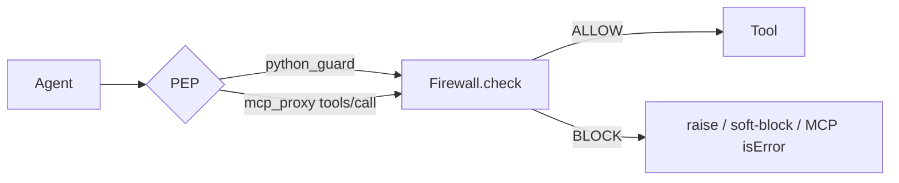

# Docs index

| Doc | Purpose |
|-----|---------|
| **[GETTING_STARTED.md](GETTING_STARTED.md)** | Install → identity → `zta` → first BLOCK |
| **[ARCHITECTURE_OVERVIEW.md](ARCHITECTURE_OVERVIEW.md)** | Pipeline / modules / network diagrams, ALLOW·BLOCK, tests done, QA gaps |
| **[RESULTS.md](RESULTS.md)** | How to read eval JSON / ASR vs utility |
| **[RUNBOOK.md](RUNBOOK.md)** | Profiles, env, audit, BLOCK storms, soft-block |
| [FIREWALL.md](FIREWALL.md) | Architecture / pipeline / modules (detail) |
| [GOALS.md](GOALS.md) | Success **and** failure criteria (Fable) |
| [TEST_PLAN.md](TEST_PLAN.md) | Scenario lanes; harness ≠ scenario suite |
| [DETECTION.md](DETECTION.md) | What detection work fits the POC |
| [TOOLING.md](TOOLING.md) | Cursor skills, brink commands |
| [SUPPORT.md](SUPPORT.md) | Support matrix (Python / MCP / profiles / metrics) |
| [ENTERPRISE.md](ENTERPRISE.md) | Enterprise readiness checklist (honest) |
| [../SECURITY.md](../SECURITY.md) | Threat model + what we don’t protect |
| [../CHANGELOG.md](../CHANGELOG.md) | Versioned release notes |
| [../HANDOFF.md](../HANDOFF.md) | Pick-up status + roadmap |
| [../paper/EVIDENCE.md](../paper/EVIDENCE.md) | Claim ledger (repo → paper) |
| [../LESSONS_LEARNED.md](../LESSONS_LEARNED.md) | Process rules |

## Tracewall at a glance

One seam: `await firewall.check(event)` → ALLOW or BLOCK. Fast path is
L0 → content → policy → trust/taint gate; semantic only on escalate / content-flag.
PEPs: in-process `guard` / `GuardedToolNode`, or MCP stdio `mcp_proxy` (screens
`tools/call` only). Profiles: `zta` / `paranoid` / `balanced` / `permissive`.

Full diagrams, test inventory, and QA gap matrix:
[`ARCHITECTURE_OVERVIEW.md`](ARCHITECTURE_OVERVIEW.md).

## Paper

- Draft: [`paper/PAPER.md`](../paper/PAPER.md), PDF: [`paper/tracewall.pdf`](../paper/tracewall.pdf)  
- Evidence-only claims: [`paper/EVIDENCE.md`](../paper/EVIDENCE.md)  
- `paper/watchtower.tex` is **stale brand** — do not submit.
